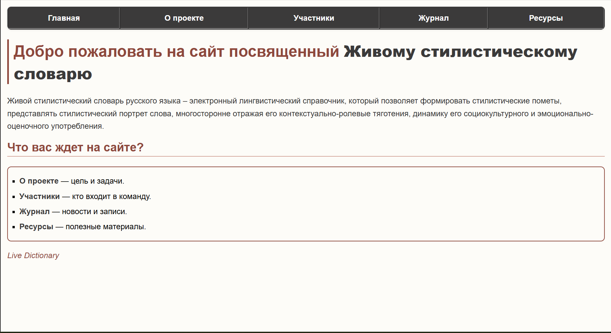
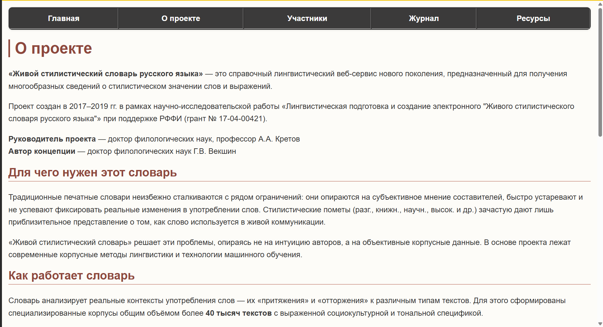
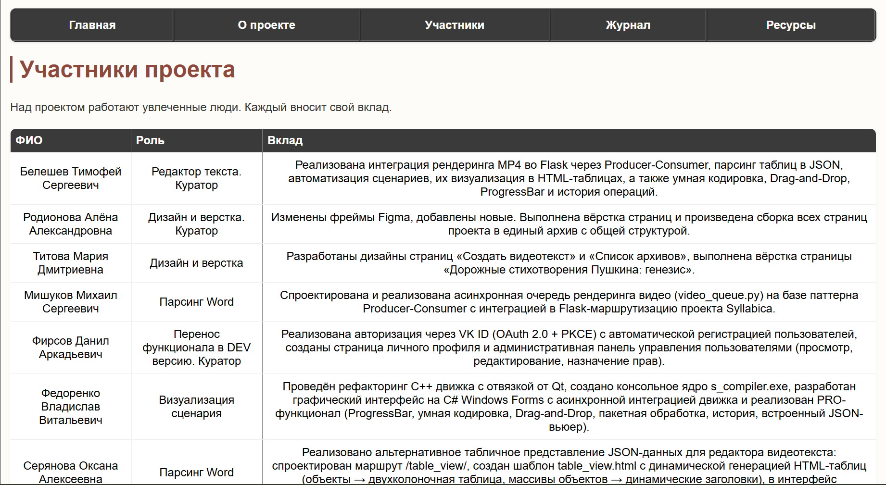
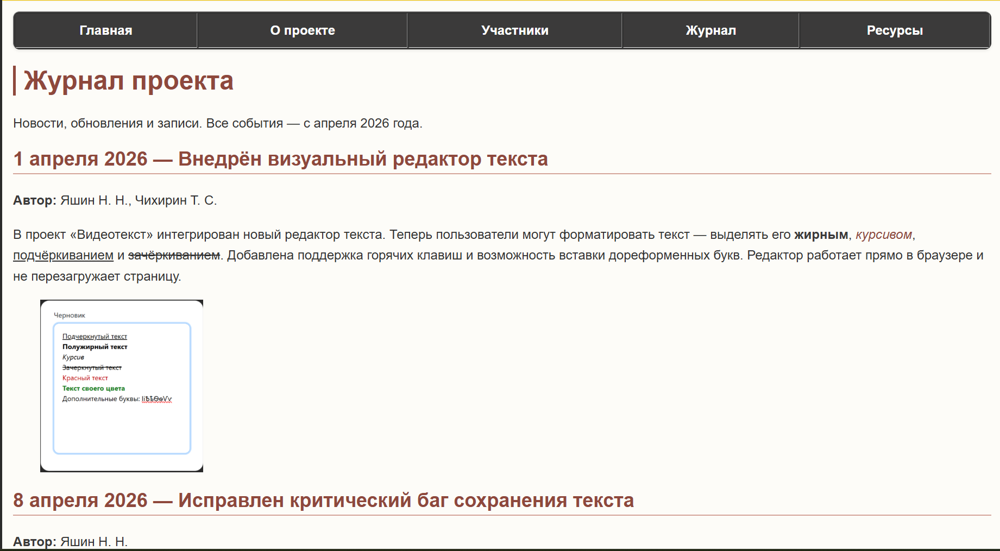
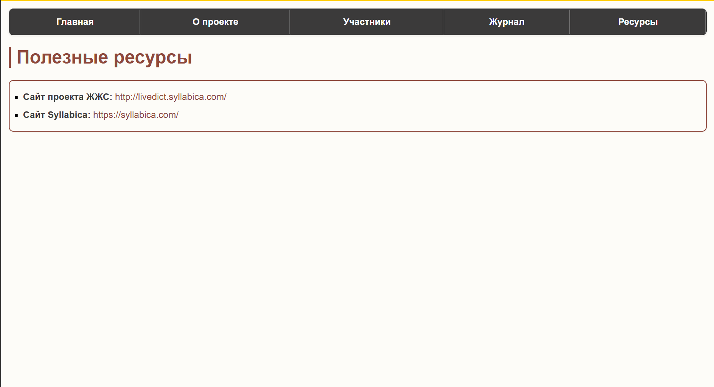

# Федеральное государственное автономное образовательное учреждение высшего образования
# «МОСКОВСКИЙ ПОЛИТЕХНИЧЕСКИЙ УНИВЕРСИТЕТ»

**Факультет информационных технологий**
**Кафедра «Информатика и информационные технологии»**

**Направление подготовки/специальность:** 09.03.02 / Автоматизированные системы обработки информации и управления

---

# ОТЧЕТ
## по проектной практике

**Студент:** Титова Мария Дмитриевна
**Группа:** 251–331
**Место прохождения практики:** Московский Политех, кафедра «Информатика и информационные технологии»

Отчет принят с оценкой _______________  
Дата ________________________  

**Руководитель практики:** _________________________________

---

**Москва 2026**

---

## ОГЛАВЛЕНИЕ

1. [ВВЕДЕНИЕ](#введение)
2. [Общая информация о проекте](#1-общая-информация-о-проекте)
   - Название проекта
   - Цели и задачи проекта
3. [Общая характеристика деятельности организации (заказчика)](#2-общая-характеристика-деятельности-организации-заказчика-проекта)
4. [Описание задания по проектной практике](#3-описание-задания-по-проектной-практике)
5. [Описание достигнутых результатов](#4-описание-достигнутых-результатов-по-проектной-практике)
6. [ЗАКЛЮЧЕНИЕ](#заключение)
7. [СПИСОК ИСПОЛЬЗОВАННОЙ ЛИТЕРАТУРЫ](#список-использованной-литературы)
8. [ПРИЛОЖЕНИЯ](#приложения)

---

## ВВЕДЕНИЕ

В рамках проектной практики стояла задача создать многостраничный сайт для проекта «Живой стилистический словарь русского языка. Лингвистический интернет-сервис». Итоговый продукт должен был быть не только рабочим, но и готовым к публичному представлению: с единой системой стилей, удобной навигацией и структурированным контентом.

Практика проходила в период с 03 февраля 2025 г. по 24 мая 2025 г. под руководством куратора от кафедры «Информатика и информационные технологии».

---

## 1. ОБЩАЯ ИНФОРМАЦИЯ О ПРОЕКТЕ

### 1.1. Название проекта

**«Живой стилистический словарь»** — многостраничный сайт лингвистического интернет-сервиса.

### 1.2. Цели и задачи проекта

**Цель проекта:**
Разработать полноценный многостраничный сайт для лингвистического сервиса «Живой стилистический словарь», обеспечивающий удобную навигацию, единое стилевое оформление и структурированное представление информации о проекте, участниках, новостях и ресурсах.

**Задачи проекта:**
- определить структуру сайта из 5 основных страниц;
- спроектировать единую навигационную систему;
- разработать HTML-скелеты всех страниц без стилей;
- создать и применить единую систему CSS-стилей;
- наполнить разделы контентом (Главная, О проекте, Участники, Журнал, Ресурсы);
- освоить инструменты Git и Markdown для оформления репозитория;
- подготовить итоговый отчёт.

---

## 2. ОБЩАЯ ХАРАКТЕРИСТИКА ДЕЯТЕЛЬНОСТИ ОРГАНИЗАЦИИ (ЗАКАЗЧИКА ПРОЕКТА)

### 2.1. Наименование заказчика

Заказчиком проекта выступает **Векшин Георгий Викторович** — руководитель проектной практики, представитель кафедры «Информатика и информационные технологии» Московского Политеха.

### 2.2. Организационная структура

Заказчик выступает как координатор проектной деятельности студентов. Непосредственный контроль осуществляет руководитель практики и куратор по дисциплине «Проектная деятельность». В процессе выполнения проекта студент взаимодействовал с заказчиком для уточнения требований, обсуждения структуры сайта и получения обратной связи.

### 2.3. Описание деятельности

Основная деятельность заказчика — образовательная и научно-исследовательская. Применительно к данному проекту — формирование у студента компетенций в области веб-разработки, проектирования программных продуктов и документирования, а также получение готового сайта, который может быть использован в учебных целях и как демонстрационный пример студенческих работ.

---

## 3. ОПИСАНИЕ ЗАДАНИЯ ПО ПРОЕКТНОЙ ПРАКТИКЕ

Студенту было выдано задание разработать многостраничный сайт для лингвистического сервиса. Требования к итоговому продукту:

### Функциональные требования:
- наличие 5 основных страниц: Главная, О проекте, Участники, Журнал, Ресурсы;
- единое навигационное меню на всех страницах для перемещения между разделами;
- отображение информации об участниках проекта (таблица);
- ведение журнала новостей с записями о ходе разработки;
- список полезных ресурсов и ссылок.

### Технические требования:
- язык реализации — HTML5, CSS3;
- единый файл стилей для всех страниц (style.css);
- использование классов на теге `<body>` для уникальной стилизации каждой страницы;
- скругление углов элементов (border-radius: 12px);
- цветовая схема: фон страниц `#FDFCF8`, фон меню `#3B3A3A`, акцентный цвет `#8E483C`;
- оформление репозитория на GitHub с README-файлом.

### Отчётные требования:
- ведение проекта через Git с осмысленными коммитами;
- подготовка итогового отчёта по практике.

---

## 4. ОПИСАНИЕ ДОСТИГНУТЫХ РЕЗУЛЬТАТОВ ПО ПРОЕКТНОЙ ПРАКТИКЕ

В ходе проектной практики были достигнуты следующие результаты:

**1. Изучена предметная область.**
Проведён обзор существующих лингвистических интернет-сервисов и словарных сайтов. Выявлены сильные и слабые стороны аналогов: навигационная сложность, отсутствие единого стиля. Принято решение создать собственный сайт с простой навигацией и единым стилевым оформлением.

**2. Спроектирована и реализована структура сайта.**
Разработана архитектура из 5 основных страниц. Созданы HTML-скелеты всех страниц с единой системой навигации через табличное меню.

**3. Разработана единая система стилей (CSS).**
Создан общий файл `style.css`, содержащий:
- стили для тела документа, таблицы меню, ссылок;
- цветовую схему: фон `#FDFCF8`, меню `#3B3A3A`, акценты `#8E483C`;
- скругление углов 12px для всех блоков;
- уникальные классы для каждой страницы (`.page-home`, `.page-about`, `.page-participans`, `.page-log`, `.page-resources`).

**4. Наполнены все разделы контентом.**
- **Главная страница:** приветствие, описание проекта «Живой стилистический словарь», цели и задачи.
- **О проекте:** подробное описание лингвистического сервиса, цели и основные задачи.
- **Участники:** таблица с информацией о членах команды (ФИО, роль, интересы).
- **Журнал:** новостные записи, отражающие ключевые этапы разработки (внедрение редактора текста, исправление багов, запуск API, авторизация через VK ID).
- **Ресурсы:** список полезных ссылок и материалов.

**5. Освоены инструменты разработки.**
- Git: инициализация репозитория, коммиты, push на GitHub;
- Markdown: оформлен README с инструкцией по запуску и описанием проекта;
- HTML/CSS: отработка навыков вёрстки и стилизации.

**6. Обеспечена масштабируемость проекта.**
Добавление новых страниц возможно через наследование существующей структуры HTML и CSS-классов.

**7. Подготовлена отчётная документация.**
Оформлен итоговый отчёт, включающий описание проекта, целей, задач и достигнутых результатов. Репозиторий проекта доступен по ссылке.

---

## ЗАКЛЮЧЕНИЕ

В результате проектной практики полностью решена поставленная задача — разработан многостраничный сайт для проекта «Живой стилистический словарь русского языка». Сайт функционирует стабильно, обладает единым стилевым оформлением и удобной навигацией.

В процессе выполнения проекта удалось освоить полный цикл создания веб-продукта: от проектирования структуры и вёрстки до стилизации и публикации в репозитории. Получены практические навыки:
- создания семантической HTML-разметки;
- оформления сайта с помощью CSS (цвета, рамки, отступы, скругления);
- использования классов для разделения стилей между страницами;
- ведения проекта через Git и оформления репозитория на GitHub;
- работы с Markdown для документации.

**Ценность выполненной работы для заказчика:**
- получен готовый, работоспособный веб-продукт, который может использоваться для демонстрации на занятиях по веб-разработке и проектным дисциплинам;
- показан пример прохождения студентом полного цикла разработки: разметка, стили, репозиторий, документация;
- сайт может быть расширен и доработан другими студентами: добавление новых страниц, подключение серверной логики, интеграция с базами данных.

Таким образом, все задачи, поставленные перед началом практики, выполнены в полном объёме.

---

## СПИСОК ИСПОЛЬЗОВАННОЙ ЛИТЕРАТУРЫ

1. Официальная документация HTML5. — URL: [https://developer.mozilla.org/ru/docs/Web/HTML](https://developer.mozilla.org/ru/docs/Web/HTML) (дата обращения: май 2025).
2. Официальная документация CSS3. — URL: [https://developer.mozilla.org/ru/docs/Web/CSS](https://developer.mozilla.org/ru/docs/Web/CSS) (дата обращения: май 2025).
3. Руководство по Git. — URL: [https://git-scm.com/book/ru/v2](https://git-scm.com/book/ru/v2) (дата обращения: май 2025).
4. Руководство по Markdown. — URL: [https://www.markdownguide.org/](https://www.markdownguide.org/) (дата обращения: май 2025).

---

## ПРИЛОЖЕНИЯ

### Приложение 1. Структура `index.html`
```html
<!DOCTYPE html>
<html lang="ru">
<head>
    <link rel="stylesheet" href="css/style.css">
    <meta charset="UTF-8">
    <title>Главная</title>
</head>
<body class="page-home">

    <!-- Меню -->
    <table border="1" cellpadding="10" width="100%">
        <tr>
            <td><a href="index.html">Главная</a></td>
            <td><a href="about.html">О проекте</a></td>
            <td><a href="participans.html">Участники</a></td>
            <td><a href="log.html">Журнал</a></td>
            <td><a href="resources.html">Ресурсы</a></td>
        </tr>
    </table>

    <!-- Контент -->
    <h1>Добро пожаловать на сайт посвященный <strong>Живому стилистическому словарю</strong></h1>
    <p>Живой стилистический словарь русского языка – электронный лингвистический справочник, который позволяет формировать стилистические пометы, представлять стилистический портрет слова, многосторонне отражая его контекстуально-ролевые тяготения, динамику его социокультурного и эмоционально-оценочного употребления.</p>

    <h2>Что вас ждет на сайте?</h2>
    <ul>
        <li><strong>О проекте</strong> — цель и задачи.</li>
        <li><strong>Участники</strong> — кто входит в команду.</li>
        <li><strong>Журнал</strong> — новости и записи.</li>
        <li><strong>Ресурсы</strong> — полезные материалы.</li>
    </ul>

    <p><em>Live Dictionary</em></p>

</body>
</html>
```
### Приложение 2. Структура `resources.html`
```html
<!DOCTYPE html>
<html lang="ru">
<head>
    <link rel="stylesheet" href="css/style.css">
    <meta charset="UTF-8">
    <title>Ресурсы</title>
</head>
<body class="page-resources">
    <table border="1" cellpadding="10" width="100%">
        <tr>
            <td><a href="index.html">Главная</a></td>
            <td><a href="about.html">О проекте</a></td>
            <td><a href="participans.html">Участники</a></td>
            <td><a href="log.html">Журнал</a></td>
            <td><a href="resources.html">Ресурсы</a></td>
        </tr>
    </table>

    <h1>Полезные ресурсы</h1>

    <ul>
        <li><strong>Сайт проекта ЖЖС:</strong> <a href="http://livedict.syllabica.com/">http://livedict.syllabica.com/</a></li>
        <li><strong>Сайт Syllabica:</strong> <a href="https://syllabica.com/">https://syllabica.com/</a></li>
    </ul>
</body>
</html>
```
### Приложение 3. Структура `participants.html`
```html
<!DOCTYPE html>
<html lang="ru">
<head>
    <link rel="stylesheet" href="css/style.css">
    <meta charset="UTF-8">
    <title>Участники</title>
</head>
<body class="page-participans">

    <table border="1" cellpadding="10" width="100%">
        <tr>
            <td><a href="index.html">Главная</a></td>
            <td><a href="about.html">О проекте</a></td>
            <td><a href="participans.html">Участники</a></td>
            <td><a href="log.html">Журнал</a></td>
            <td><a href="resources.html">Ресурсы</a></td>
        </tr>
    </table>

    <h1>Участники проекта</h1>
    <p>Над проектом работают увлеченные люди. Каждый вносит свой вклад.</p>

    <table border="1" cellpadding="8">
        <tr>
            <th>ФИО</th>
            <th>Роль</th>
            <th>Вклад</th>
        </tr>
        <tr>
            <td>Белешев Тимофей Сергеевич</td>
            <td>Редактор текста. Куратор</td>
            <td>Реализована интеграция рендеринга MP4 во Flask через Producer-Consumer, парсинг таблиц в JSON, автоматизация сценариев, их визуализация в HTML-таблицах, а также умная кодировка, Drag-and-Drop, ProgressBar и история операций.</td>
        </tr>
        <tr>
           <td>Родионова Алёна Александровна</td>
            <td>Дизайн и верстка. Куратор</td>
            <td>Изменены фреймы Figma, добавлены новые. Выполнена вёрстка страниц и произведена сборка всех страниц проекта в единый архив с общей структурой.</td>
        </tr>
        <tr>
           <td>Титова Мария Дмитриевна</td>
            <td>Дизайн и верстка</td>
            <td>Разработаны дизайны страниц «Создать видеотекст» и «Список архивов», выполнена вёрстка страницы «Дорожные стихотворения Пушкина: генезис».</td>
        </tr>
        <tr>
           <td>Мишуков Михаил Сергеевич</td>
            <td>Парсинг Word</td>
            <td>Спроектирована и реализована асинхронная очередь рендеринга видео (video_queue.py) на базе паттерна Producer-Consumer с интеграцией в Flask-маршрутизацию проекта Syllabica.</td>
        </tr>
        <tr>
           <td>Фирсов Данил Аркадьевич</td>
            <td>Перенос функционала в DEV версию. Куратор</td>
            <td>Реализована авторизация через VK ID (OAuth 2.0 + PKCE) с автоматической регистрацией пользователей, созданы страница личного профиля и административная панель управления пользователями (просмотр, редактирование, назначение прав).</td>
        </tr>
         <tr>
           <td>Федоренко Владислав Витальевич</td>
            <td>Визуализация сценария</td>
            <td>Проведён рефакторинг C++ движка с отвязкой от Qt, создано консольное ядро s_compiler.exe, разработан графический интерфейс на C# Windows Forms с асинхронной интеграцией движка и реализован PRO-функционал (ProgressBar, умная кодировка, Drag-and-Drop, пакетная обработка, история, встроенный JSON-вьюер).</td>
        </tr>
        <tr>
           <td>Серянова Оксана Алексеевна</td>
            <td>Парсинг Word</td>
            <td>Реализовано альтернативное табличное представление JSON-данных для редактора видеотекста: спроектирован маршрут /table_view/<text_id>, создан шаблон table_view.html с динамической генерацией HTML-таблиц (объекты → двухколоночная таблица, массивы объектов → динамические заголовки), в интерфейс json_editor.html добавлена кнопка переключения представления.</td>
        </tr>
    </table>
</body>
</html>
```
### Приложение 4. Структура `log.html`
```html
<!DOCTYPE html>
<html lang="ru">
<head>
    <link rel="stylesheet" href="css/style.css">
    <meta charset="UTF-8">
    <title>Журнал</title>
</head>
<body class="page-log">

    <table border="1" cellpadding="10" width="100%">
        <tr>
            <td><a href="index.html">Главная</a></td>
            <td><a href="about.html">О проекте</a></td>
            <td><a href="participans.html">Участники</a></td>
            <td><a href="log.html">Журнал</a></td>
            <td><a href="resources.html">Ресурсы</a></td>
        </tr>
    </table>

    <h1>Журнал проекта</h1>
    <p>Новости, обновления и записи. Все события — с апреля 2026 года.</p>

    <h2>1 апреля 2026 — Внедрён визуальный редактор текста</h2>
    <p><strong>Автор:</strong> Яшин Н. Н., Чихирин Т. С.</p>
    <p>В проект «Видеотекст» интегрирован новый редактор текста. Теперь пользователи могут форматировать текст — выделять его <strong>жирным</strong>, <em>курсивом</em>, <u>подчёркиванием</u> и <s>зачёркиванием</s>. Добавлена поддержка горячих клавиш и возможность вставки дореформенных букв. Редактор работает прямо в браузере и не перезагружает страницу.</p>
    

    <h2>8 апреля 2026 — Исправлен критический баг сохранения текста</h2>
    <p><strong>Автор:</strong> Яшин Н. Н.</p>
    <p>Обнаружена ошибка: при сохранении текста из нового редактора все строки слипались в одну. Причина — замена стандартного поля <code>textarea</code> на <code>div</code>. Проблема решена с помощью библиотек <strong>bleach</strong> и <strong>bs4</strong>. Теперь структура строк сохраняется, а стили текста не сбрасываются после перезагрузки страницы. Также восстановлена возможность перемешивать строки местами.</p>
    

    <h2>15 апреля 2026 — Запущен API для генерации видео из текста</h2>
    <p><strong>Автор:</strong> Наврузов Р. А.</p>
    <p>Появилась возможность создавать видеоролики прямо из текстовых сценариев! Серверное API работает асинхронно: вы отправляете текст, получаете идентификатор задачи, а когда видео готово — скачиваете его в формате MP4. В основе лежат <strong>FastAPI</strong>, <strong>Pygame</strong> и <strong>FFmpeg</strong>. Система уже упакована в Docker и готова к развёртыванию.</p>

    <h2>22 апреля 2026 — Появилась страница для работы с JSON-сценариями</h2>
    <p><strong>Автор:</strong> Белешев Т. С.</p>
    <p>Добавлена отдельная страница, где можно просматривать, редактировать и сохранять JSON-файлы сценариев. Редактор поддерживает подсветку синтаксиса и нумерацию строк (библиотека <strong>Ace.js</strong>). Теперь вы можете загрузить внешний JSON, отредактировать его в браузере, скачать обратно или сразу запустить генерацию видеотекста — без перезагрузки страницы, через <strong>Fetch API</strong>.</p>
    

    <h2>3 мая 2026 — Внедрена авторизация через VK ID и админ-панель</h2>
    <p><strong>Автор:</strong> Фирсов Д. А.</p>
    <p>На сайт добавлена система входа через <strong>VK ID</strong> (новый стандарт OAuth 2.0 + PKCE). После авторизации пользователи видят свой аватар в шапке сайта, а администраторы получают доступ к списку всех пользователей и могут управлять их правами. Реализованы страница личного профиля и административная панель. Сессии и права доступа полностью работают на сервере.</p>
    
    <p><em>Следите за обновлениями — впереди ещё больше изменений!</em></p>

</body>
</html>
```
### Приложение 5. Структура `about.html`
```html
<!DOCTYPE html>
<html lang="ru">
<head>
    <link rel="stylesheet" href="css/style.css">
    <meta charset="UTF-8">
    <title>О проекте</title>
</head>
<body class="page-about">

    <table border="1" cellpadding="10" width="100%">
        <tr>
            <td><a href="index.html">Главная</a></td>
            <td><a href="about.html">О проекте</a></td>
            <td><a href="participans.html">Участники</a></td>
            <td><a href="log.html">Журнал</a></td>
            <td><a href="resources.html">Ресурсы</a></td>
        </tr>
    </table>

    <h1>О проекте</h1>

<p><strong>«Живой стилистический словарь русского языка»</strong> — это справочный лингвистический веб-сервис нового поколения, предназначенный для получения многообразных сведений о стилистическом значении слов и выражений.</p>

<p>Проект создан в 2017–2019 гг. в рамках научно-исследовательской работы «Лингвистическая подготовка и создание электронного "Живого стилистического словаря русского языка"» при поддержке РФФИ (грант № 17-04-00421).</p>

<p><strong>Руководитель проекта</strong> — доктор филологических наук, профессор А.А. Кретов<br>
<strong>Автор концепции</strong> — доктор филологических наук Г.В. Векшин</p>

<h2>Для чего нужен этот словарь</h2>

<p>Традиционные печатные словари неизбежно сталкиваются с рядом ограничений: они опираются на субъективное мнение составителей, быстро устаревают и не успевают фиксировать реальные изменения в употреблении слов. Стилистические пометы (разг., книжн., научн., высок. и др.) зачастую дают лишь приблизительное представление о том, как слово используется в живой коммуникации.</p>

<p>«Живой стилистический словарь» решает эти проблемы, опираясь не на интуицию авторов, а на объективные корпусные данные. В основе проекта лежат современные корпусные методы лингвистики и технологии машинного обучения.</p>

<h2>Как работает словарь</h2>

<p>Словарь анализирует реальные контексты употребления слов — их «притяжения» и «отторжения» к различным типам текстов. Для этого сформированы специализированные корпусы общим объёмом более <strong>40 тысяч текстов</strong> с выраженной социокультурной и тональной спецификой.</p>

<p>На основе этих данных сервис определяет:</p>
<ul>
    <li>стилистическую окраску слова (разговорная, книжная, поэтическая, идеологическая и т.д.);</li>
    <li>возрастную и средовую ориентацию лексики;</li>
    <li>статус слова (неологизм, устаревающее, архаизм);</li>
    <li>динамику изменений стилистических свойств языковых единиц.</li>
</ul>

<p>Общий объём словаря составляет более <strong>8 миллионов словоупотреблений</strong>.</p>

<h2>Стилевой подсказчик</h2>

<p>В составе проекта разработан сервис <strong>«Стилевой подсказчик»</strong>, который формирует обобщённый стилевой портрет текста по базовым стилистическим измерениям. Экспертное тестирование подтвердило точность сервиса более <strong>80%</strong> при идентификации стилевой принадлежности текста.</p>

<h2>Уникальность проекта</h2>

<p>Главное отличие «Живого стилистического словаря» от существующих аналогов (Национального корпуса русского языка, систем автоматического определения жанра или авторства и др.) — ориентация не на формальные признаки текста, а на его <strong>коммуникативно-ролевую природу</strong>. Словарь фиксирует не любые тексты формально научного или публицистического характера, а те, где автор активно позиционирует себя в определённой роли (учёного, идеолога, поэта, обывателя и т.д.). Именно в таких текстах наиболее ярко проявляется стилистическая семантика языковых единиц.</p>

<h2>Кому и зачем это нужно</h2>

<p>Словарь будет полезен:</p>
<ul>
    <li>изучающим русский язык (как родной, так и иностранный);</li>
    <li>преподавателям, школьникам и студентам;</li>
    <li>копирайтерам, редакторам, переводчикам и рерайтерам;</li>
    <li>специалистам в области идеологической и коммерческой коммуникации;</li>
    <li>разработчикам систем машинного перевода, автоматического реферирования и анализа текстов.</li>
</ul>

<p>«Живой стилистический словарь русского языка» станет надёжным помощником для всех, кто стремится проверить и углубить своё знание языка, понять реальные тенденции словоупотребления, оценить стилистическую уместность речи и повысить её эффективность.</p>

    <p><a href="participans.html">→ Познакомиться с участниками</a></p>

</body>
</html>
```
### Приложение 6. Структура `css/styles.css`
```css
body {
    font-family: Arial, sans-serif;
    font-size: 24px;
    margin: 0;
    padding: 20px;
    background-color: #FDFCF8;  
}

table {
    background-color: #3B3A3A;
    margin-bottom: 30px;
    width: 100%;
    border-radius: 12px;        
    overflow: hidden;          
    box-shadow: 0 2px 5px rgba(0,0,0,0.1);
}

table td {
    text-align: center;
    padding: 12px 10px;
}

table a {
    color: white;
    text-decoration: none;
    font-weight: bold;
    display: inline-block;
    padding: 5px 15px;
    border-radius: 8px;
    transition: all 0.3s ease;
}

table a:hover {
    color: white;
    background-color: #8E483C; 
    border-radius: 8px;
}

a {
    color: #8E483C;
    text-decoration: none;
}

a:hover {
    text-decoration: underline;
    color: #6b362d;
}

h1 {
    color: #8E483C;
    border-left: 5px solid #8E483C;
    padding-left: 15px;
    margin-top: 20px;
}

h2 {
    color: #8E483C;
    border-bottom: 2px solid #d4a59a;
    padding-bottom: 5px;
    margin-top: 25px;
}

h3 {
    color: #5c2e26;
}

p {
    color: #333;
    line-height: 1.6;
}

ul, ol {
    padding: 15px 20px 15px 35px;
    border-radius: 12px;
    line-height: 1.6;
    border: 2px solid #8E483C; 
    box-shadow: 0 1px 3px rgba(0,0,0,0.05);
    list-style-type: square;
}

li {
    margin: 8px 0;
}

table:not(:first-of-type) {
    background-color: #ffffff;
    border-collapse: collapse;
    width: 100%;
    border-radius: 12px;
    overflow: hidden;
    margin-top: 15px;
    box-shadow: 0 2px 5px rgba(0,0,0,0.05);
}

th {
    background-color: #3B3A3A;
    color: white;
    padding: 10px;
    text-align: left;
}

td {
    padding: 10px;
    border-bottom: 1px solid #eee;
}

em {
    color: #8E483C;
    font-style: italic;
}

strong {
    color: #3B3A3A;
}

img {
    padding-left: 50px;
}
```
### Приложение 7. Вид страниц сайта





